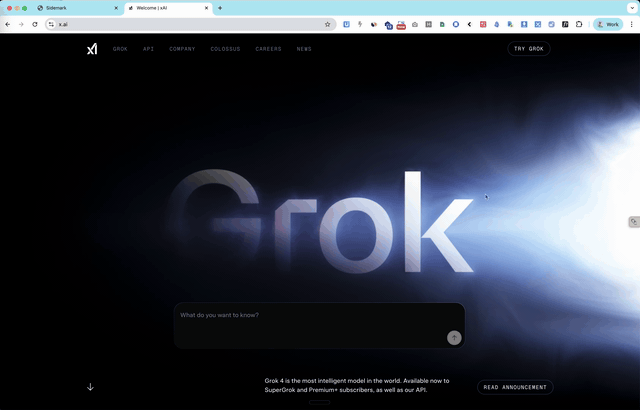

**Sidemark (Chrome Extension)**

- Simple URL manager with an options page and a lightweight floating icon overlay on every page for quick access to settings.

**Features**
- Save URLs, de-duplicate, and validate format.
- List with single-delete, Open All, and Clear All.
- Edit all saved URLs as plain text (one URL per line) with Save/Cancel and inline validation.

**Demo**

**Install in Chrome**
- Open `chrome://extensions/`.
- Turn on `Developer mode` (top-right toggle).
- Click `Load unpacked` and select this folder (the directory containing `manifest.json`).
- Optional: Pin the extension from the toolbar puzzle icon.

**Open the Options Page**
- From `chrome://extensions/` → `Sidemark` → `Details` → `Extension options`.
- Or use the floating icon on any page → `Settings`.

**Using URL Manager**
- Add: Enter a URL and click `Add URL`. Invalid URLs show an error.
- Edit as text: Click `Edit as Text`, edit one URL per line, then `Save` or `Cancel`.
- Open All: Opens all saved URLs in background tabs.
- Clear All: Deletes all saved URLs (with confirmation).
- Delete single: Click `×` next to an entry.

**Permissions**
- Uses `storage` to sync URLs and UI state (e.g., floating icon position).
- A content script runs on all pages to show the floating icon.

**Development Tips**
- After editing files, go to `chrome://extensions/` and click `Reload` on Sidemark.
- Refresh pages to apply updated content scripts.
- View page console for content script logs, and `Service Worker` (in Details) for background logs.

**Uninstall / Reset**
- To reset data, use `Clear All` in the options page.
- To remove the extension, open `chrome://extensions/` and click `Remove`.

**License**
- MIT License. See `LICENSE` for details.
